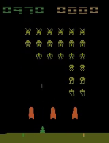
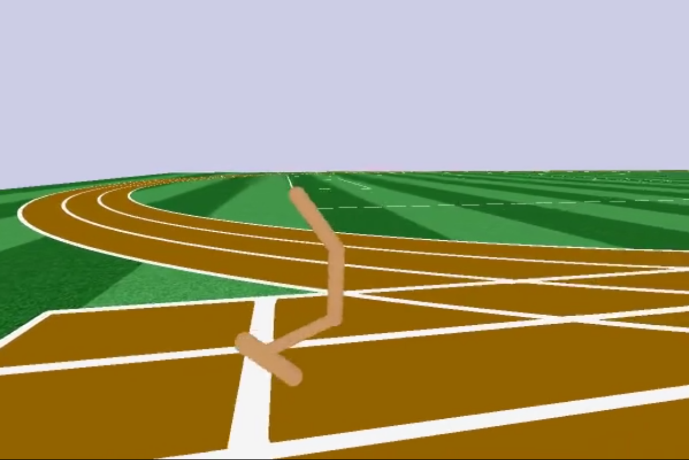
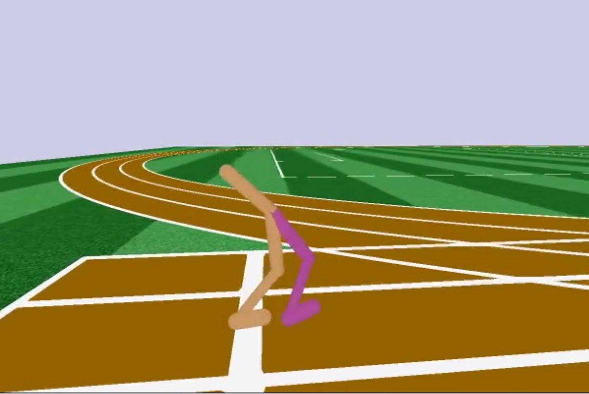

TensorFlow implementations of different reinforcement learning algorithms.

List of implemented algorithms:

- [Vanilla PG](rlexperiments/pg)
- [A2C](rlexperiments/a2c)
- [DQN](rlexperiments/dqn)
- [PPO](rlexperiments/ppo)

The package can be install by typing:

```bash
git clone https://github.com/asprenger/rl-experiments.git
cd rl-experiments
pip install -e .
```

# Demos

This is an example of an agent playing Atari Space Invaders trained with PPO. The agent is quite efficient in killing the aliens and 
also does a good job in evading the bombs. Nevertheless it still fails consistently in the 5. round because the has not yet learned 
to first kill the aliens in the lowermost row and the games terminates because the aliens touch the ground. The agent probably needs 
more training time.

<a href="https://www.youtube.com/watch?v=LYt4_W7SbPY"></a>

Here is an example of the [Roboschool](https://github.com/openai/roboschool) Hopper trained with PPO. It is interesting
that it has learned to create additional forward momentum by dashing the upper limb forward at the right time.

<a href="http://www.youtube.com/watch?v=SjIGbM5uqCY"></a>

Here is an example of the [Roboschool](https://github.com/openai/roboschool) Walker2d also trained on PPO. The movement 
is pretty clumsy and the walker falls over from time to time.

<a href="http://www.youtube.com/watch?v=qmfJQRleo5A"></a>
